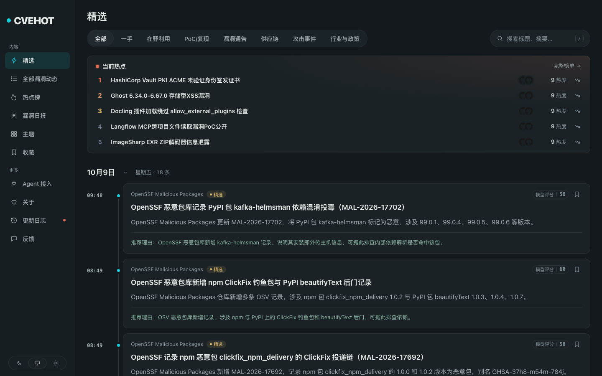
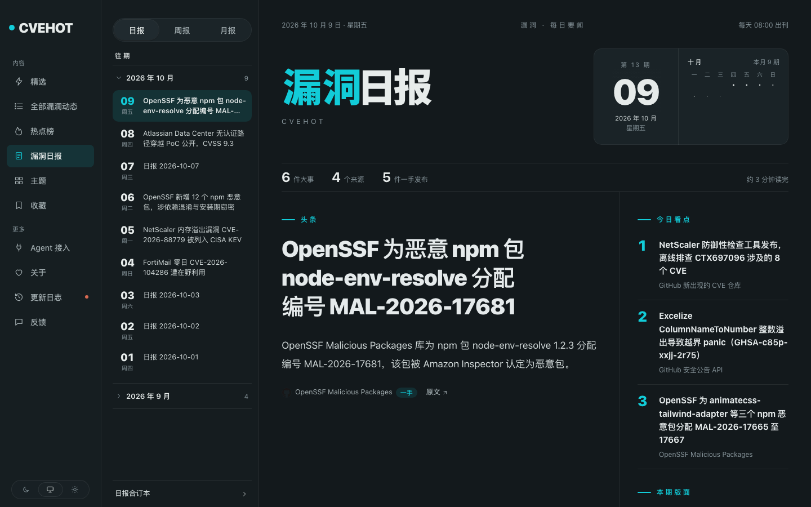
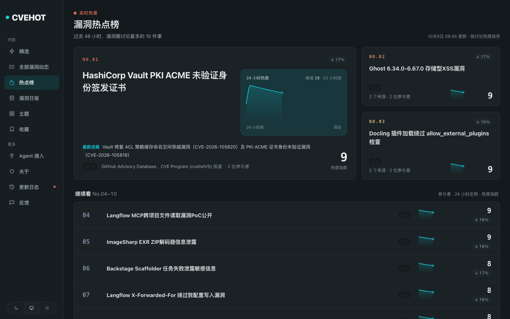

<p align="center">
  
</p>

<h1 align="center">CVEHOT</h1>

<p align="center">
  Watches new vulnerabilities, groups every source reporting the same one into a single event, and
  publishes a daily brief.
</p>

<p align="center">
  <a href="README.md">简体中文</a> · <b>English</b>
</p>

<br>

## What this is

This is a modified version of [AIHOT](https://github.com/KKKKhazix/AIHOT), an open-source engine by
[@KKKKhazix](https://github.com/KKKKhazix) (数字生命卡兹克). The engine here is upstream's; the
industry was changed from AI news to vulnerability intelligence.

Sources are the GitHub Security Advisories, cvelistV5, CISA KEV, the OpenSSF malicious-packages
dataset, and new CVE repositories on GitHub. New vulnerabilities and incidents get a headline and a
summary, are grouped under their CVE identifier, ranked by heat, and compiled into a daily report.

- Upstream: <https://github.com/KKKKhazix/AIHOT>
- License: MIT, © 2026 数字生命卡兹克, see [LICENSE](LICENSE)
- This repository's documentation is under [`docs/`](docs/); the engine's full documentation lives upstream
- Per upstream [NOTICE](NOTICE), the AIHOT name and logo are not covered by the MIT license, so this
  repository uses its own name and icons

## Screenshots







## What changed

Only the industry pack. The engine is upstream's.

- `industry/sources.json`: eight vulnerability sources, plus a self-hosted push source `gh-poc-scan`
- `industry/taxonomy.ts`: categories rebuilt around exploit-in-the-wild, public PoC, vendor advisories and supply-chain poisoning
- `industry/topics.json`: topics are vendors, components and vulnerability types
- `industry/prompts/`: scoring and fact extraction rewritten for vulnerabilities
- `industry/selection.ts`: selection thresholds retuned for vulnerability intelligence
- `site/site.ts`: site name, wording, home and about copy
- `site/brand/`: own icons
- `modules/cve-repo-index/`: new, how many PoC repositories exist for a given CVE
- `modules/gh-poc-scan/`: new, periodically scans GitHub for new CVE repositories

## Credit

`modules/cve-repo-index/` follows [unSafe.sh's CVE page](https://unsafe.sh/cve), which collects GitHub repositories mentioning a CVE in bulk and can therefore answer how many PoCs exist for a given identifier.

Both of this project's existing mechanisms only look at repositories created in the last few days (`gh-poc-scan` and the `json-gh-new-cve-repos` source), so there is no historical depth. The index fills that gap. Rows go into its own `cve_repos` table, a lookup by identifier returns a definite number, and nothing feeds selection, grouping or the daily report. No model calls.

The GitHub search API returns at most 1000 results per query, and slicing by month still truncates busy months. So besides time-sliced backfill there is `--lookup <CVE> --live`, which asks GitHub directly for a single identifier's authoritative count.

The commands all run inside the container.

```bash
# Look it up locally and ask GitHub for the authoritative count as well
docker compose exec -T worker node scripts/cve-repo-index.ts --lookup CVE-2026-21589 --live

# Local index only: first-seen date and stars, no network
docker compose exec -T worker node scripts/cve-repo-index.ts --lookup CVE-2026-21589

# Coverage
docker compose exec -T worker node scripts/cve-repo-index.ts --stats

# Backfill history, sliced by month
docker compose exec -T worker node scripts/cve-repo-index.ts --backfill --from-year 2024 --pages 3
```

The daily increment needs no attention; the engine's scheduler runs it at 05:20 (see `modules/cve-repo-index/server.ts`).

## Run it

Needs Docker and Node.js 24, plus an OpenAI-compatible model API key.

```bash
git clone https://github.com/zseeu1/CVEHOT.git
cd CVEHOT
node scripts/init-env.ts --llm-key <your model API key>
docker compose up -d --build
```

Open <http://localhost:3000>. Admin is at `/admin`; the password is `ADMIN_PASSWORD` in `.env`.

### Set up GITHUB_TOKEN

A few sources use the GitHub API (security advisories, new CVE repositories). Unauthenticated search allows 10 requests per minute; a token keeps them steady and makes backfilling the CVE index much faster.

1. Open <https://github.com/settings/tokens/new>
2. Any note will do, pick an expiration, tick **`public_repo`** (read access is all that is needed)
3. Click **Generate token** at the bottom and copy the `ghp_...` string
4. Add a line to the project's `.env`: `GITHUB_TOKEN=ghp_...`
5. Restart: `docker compose up -d`

See [docs/deploy.md](docs/deploy.md) for deployment, domains and HTTPS.

## Upstream

The engine comes from [AIHOT](https://github.com/KKKKhazix/AIHOT), by
[@KKKKhazix](https://github.com/KKKKhazix). Engine issues belong upstream; the industry changes in
this repository are mine.

To pull upstream updates, add the remote once.

```bash
git remote add upstream https://github.com/KKKKhazix/AIHOT.git
git fetch upstream && git merge upstream/main
```

## License

MIT, see [LICENSE](LICENSE). The AIHOT name and logo are not covered by it, see [NOTICE](NOTICE).
